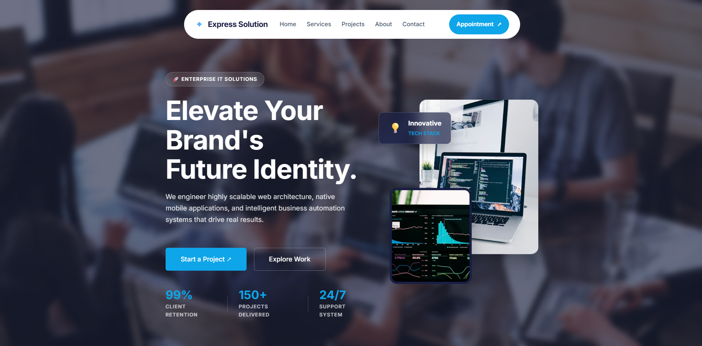

# Express Solution Ltd. - Corporate Agency Website

> A highly professional, premium, and fully responsive corporate website built for a top-tier digital IT solutions agency. 



## Key Features

This project incorporates modern web design trends and advanced CSS architectures to deliver a seamless user experience:

* **Asymmetric Split Hero Layout:** A conversion-focused hero section with powerful typography, trust metrics, and floating glassmorphism UI elements.
* **Animated Mesh Gradient Background:** A dynamic, glowing, and diffused radial background that gives a premium "Silicon Valley" tech vibe.
* **Sticky Stacking Cards:** An interactive "Architecting Digital Scale" services section where cards stack elegantly like a deck of cards on scroll.
* **Ultra-Premium Case Studies:** An overlapping 3D architectural grid layout for portfolio items, highlighting core metrics first.
* **Interactive Working Process:** A vertical animated timeline showcasing the agency's methodology.
* **Fully Responsive Design:** Pixel-perfect adaptations for tablets and mobile devices, including a smooth animated Hamburger Dropdown Menu.
* **Modern Mega Footer:** A detailed, multi-column footer with a strong Call-To-Action (CTA) section.

## Tech Stack

This landing page is built with core web technologies, ensuring maximum performance and zero dependency overhead:

* **HTML5:** Semantic and accessible markup.
* **CSS3:** Advanced styling using CSS Variables, Flexbox, CSS Grid, animations (`@keyframes`), and `position: sticky`.
* **Vanilla JavaScript:** Lightweight DOM manipulation for the sticky navbar, smooth scroll reveal (`IntersectionObserver`), and mobile menu toggling.

## Project Structure

```text
express-solution-website/
├── index.html        # Main HTML layout
├── style.css         # Global styles and responsive queries
├── script.js         # Interactive functionalities and animations
└── README.md         # Project documentation